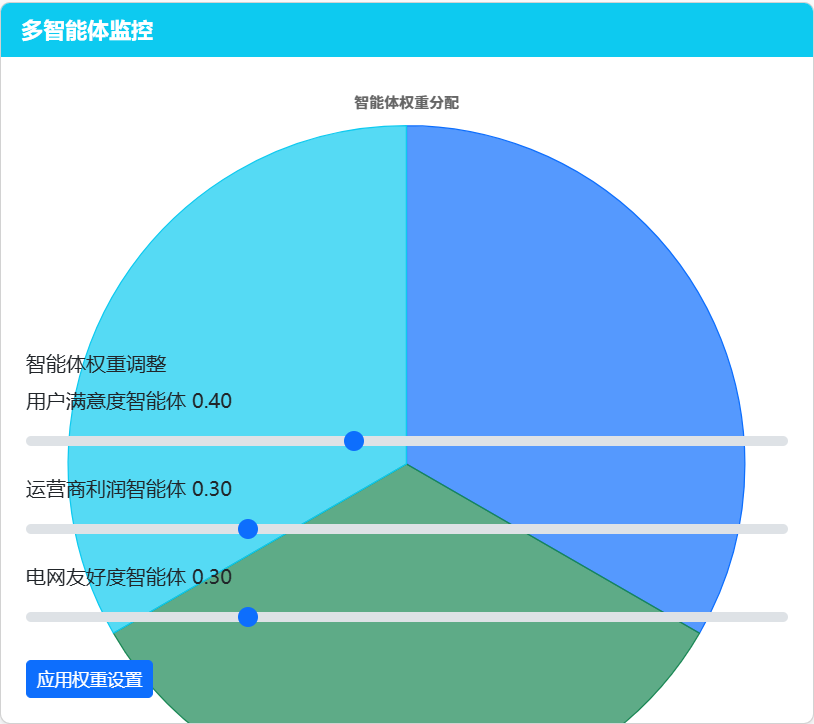

**系统使用说明 (System Usage Instructions)**

本说明旨在引导您运行并理解EV充电调度仿真系统的各项功能。

**一、 系统运行指南**

为启动并运行本仿真系统，请遵循以下步骤：

1. **环境准备:** 确保您的计算机已安装 [PyTorch](https://pytorch.org/) 环境。
2. **代码获取:** 解压 `核心代码.zip` 文件至您选定的工作目录。

   
3. **打开项目:** 使用支持Python开发的集成开发环境（IDE）或终端，导航至解压后的代码文件夹。
4. **安装依赖:** 在项目根目录的终端或命令行界面中，执行以下命令安装所需的软件包：

   ```bash
   pip install -r requirements.txt
   ```
5. **启动应用:** 在同一终端或命令行界面中，执行以下命令启动后端仿真服务：

   ```bash
   python app.py
   ```
6. **参数配置:** 修改config.json文件中的各项配置可以修改各项模拟参数。
7. **访问界面:** 打开您的网页浏览器，访问 `http://localhost:5000`。您将看到系统的Web用户界面。

**二、 系统界面概览**

系统主界面旨在提供不同层面的洞察，主要划分为四个核心功能面板：

1. **宏观调控视角 (Macro-Control Panel):** 这是系统的主要交互界面，用于配置、运行、监控和分析充电调度仿真。 **此面板的大部分核心功能已经实现。**
2. **用户面板 (User Panel):** (预期功能) 设计为面向终端电动汽车用户，提供充电站查找、状态查看、预约、充电管理等功能。 *此面板目前仅为前端设计展示，后端功能待开发。*
3. **运营商面板 (Operator Panel):** (预期功能) 设计为面向充电站运营商，提供站点监控、定价管理、运营分析、维护告警等功能。 *此面板目前仅为前端设计展示，后端功能待开发。*
4. **电网面板 (Grid Panel):** (预期功能) 设计为面向电网管理方，提供电网负荷监测、可再生能源协同分析、电能质量评估、碳排放追踪等功能。 *此面板目前仅为前端设计展示，后端功能待开发。*

**三、 宏观调控视角详解**


此面板是当前已实现功能的核心，它使您能够全面控制和审视仿真过程，评估不同策略和算法的效果。其主要构成部分如下：

1. **模拟配置区** (Simulation Configuration):

   <div style="display: flex; flex-wrap: wrap; align-items: flex-start; gap: 10px;">
   

   

   
   </div>

   * **目的:** 这是仿真的中央控制台，允许您精确设定和管理仿真实验的运行参数。
   * **功能:** 您可以在此启动、暂停或重置整个仿真过程。可以设定仿真的总时长（以天为单位）。核心在于选择不同的**策略模式**（已内置四种，例如"平衡模式""用户优先"等）和**调度算法**（已内置四种，例如"规则""协调MAS"等），以对比它们在不同场景下的表现。右侧的 **MAS (Multi-Agent System) 开关** 用于表示是否启用或禁用基于多智能体的协同调度方法，让您可以评估引入智能体自主决策后的系统行为差异。
2. **模拟信息显示** (Simulation Status Monitor):

   

   * **目的:** 提供仿真过程的即时快照，让您实时了解模拟的进展和关键绩效。
   * **功能:** 显示当前仿真对应的**模拟时间**（日期反映现实世界的起始点，时分秒则代表仿真内部流逝的时间）和**模拟进度条**。更重要的是，它实时更新**关键绩效指标**，通常包含用户满意度、运营商收益、电网友好度等**三项评分**，以及一个综合这些维度的**总评分**，直观反映当前策略下的系统综合表现。
3. **系统概览** (System Overview):

   

   * **目的:** 从更高层面展示仿真运行的核心成果，并提供与基准场景的对比，量化策略优化的效果。
   * **功能:** 此区域汇总了与"模拟信息显示"中相同的实时评分指标。其独特价值在于，它同时展示了在**无任何智能调度（即用户无序充电）的现实情况下**，这些指标的预期表现。通过这种对比，您可以清晰地看到当前所选策略和算法相对于基准情况所带来的**改进幅度**（例如，无序充电相比之差了多少用户满意度，改进了多少电网友好度等）。
4. **多智能体监控** (Multi-Agent Tuning - 仅MAS启用时可见):

   

   * **目的:** 当启用多智能体系统 (MAS) 时，此区域允许您深入探究和调整构成系统的各类智能体（如用户智能体、充电站智能体）的行为权重。
   * **功能:** 您可以调整不同类型智能体在决策过程中的**相对重要性或优先级**。这为研究和优化智能体间的交互与系统整体涌现行为提供了强大的工具。
5. **实时数据分析面板**(Real-time Analytics Dashboard):

   

   * **目的:** 提供详尽、动态的数据可视化，深入揭示仿真过程中的各种内部状态和趋势。
   * **功能:** 包含多个交互式图表：
     * **指标时间序列图:** 展示各项关键评分（用户满意度、运营商收益、电网影响等）随模拟时间演变的动态曲线。
     * **充电桩负载热力图:** 实时反映各个充电站点的繁忙程度和空间分布。
     * **用户等待时间分布图:** 统计并展示用户从到达充电站到开始充电所需等待时间的分布情况，是衡量用户体验的关键图表。
     * **电网负载时间序列图:** 显示电网总负荷随时间的变化，帮助分析充电行为对电网的影响。
   * 所有图表都会随着模拟的进行而**实时更新**。将鼠标悬停在图表的数据点或区域上，通常可以**查看更详细的数值信息**。
6. **电网实时负载指标** (Grid Load Snapshot):

   

   * **目的:** 鉴于电网负荷是评估系统影响的关键因素，此部分将其单独突出显示，并关联可再生能源的使用情况。
   * **功能:** 清晰展示当前的**电网总负载**数值。同时，显示**可再生能源在当前总发电量中的占比**，这对于评估充电行为的绿色程度和对新能源消纳的贡献至关重要。
7. **地图视图** (Map View):

   <div style="display: flex; flex-wrap: wrap; align-items: flex-start; gap: 10px;">
   

   
   </div>

   * **目的:** 提供一个地理空间视角，直观展示仿真世界中各个实体（用户、车辆、充电站）的位置、状态和交互。
   * **功能:**
     * 在地图上实时标示**用户（车辆）的位置**、**当前状态**（如行驶中、排队中、充电中）、**移动轨迹**以及**目的地充电站**。
     * 显示**充电站的位置**及其**充电桩的实时状态**（空闲、占用、故障等）。
     * 伴有**悬浮信息面板**，汇总显示各类实体的占用统计数据（如总排队人数、空闲充电桩总数等）。
     * 提供交互功能：左上角通常有**图层控制选项**，允许您选择性地显示或隐藏某些类型的实体，以获得更清晰的视图。支持地图的**缩放**。右上角允许您**筛选特定充电站**进行关注。
     * 将鼠标**悬停在地图上的用户上**，会弹出详细信息框，展示该实体的具体属性，如用户的**电量状态 (SOC)**、车辆信息、行程计划、充电偏好等。

**四、 其他辅助功能**

<div style="display: flex; flex-wrap: wrap; align-items: flex-start; gap: 10px;">

</div>

* **设置 (Settings):** 右上角的设置按钮允许您输入或修改仿真的基础配置信息（例如电价参数、车辆模型参数等）。如果不进行修改，系统将采用预设的默认配置。
* **帮助 (Help):** 旁边的问号 (?) 按钮通常会提供关于界面元素或功能的简要说明和提示信息。

**五、 用户面板概览(User Panel)**


此面板是为电动汽车车主设计的核心交互界面，旨在提供从查找充电站、了解实时状态、查看历史记录到最终完成充电的完整服务闭环。

* **核心目标:** 让用户能够方便快捷地找到最符合需求的充电站，获取决策所需的实时信息（位置、价格、排队情况、评价），管理个人信息和充电历史，并能顺利启动和监控充电过程。
* **预期实现功能:**

  1. **用户信息管理 (User Profile Management):**

     * **目的:** 集中展示用户的基本资料和车辆状态。
     * **功能:**
       * 显示用户的静态信息：用户ID、用户类型（如个人、车队）、充电偏好（如倾向快充、倾向低价）、绑定的车辆型号。
       * 显示用户的动态信息：当前车辆状态（如行驶中、停车、充电中）、实时地理位置、当前电池SOC（State of Charge，电量百分比）、目标充电SOC（用户期望充到多少电量）。
  2. **行程信息 (Trip Information):**

     * **目的:** （当前为空）未来可集成导航或行程规划，显示当前或规划的行程详情。
     * **功能:** （预期）显示当前导航路线、预计到达时间、沿途充电站推荐等。
  3. **历史记录 (Charging History):**

     * **目的:** 方便用户回顾过去的充电行为和费用。
     * **功能:**
       * 以列表形式展示近期的充电记录，包括：充电站名称、充电完成时间、单次充电电量 (kWh)。
       * 提供周期性（如本月）的充电统计：总充电次数、总花费金额、充电结束时的平均SOC。
  4. **充电站推荐 (Station Recommendations):**

     * **目的:** 基于用户位置、偏好和实时数据，智能推荐合适的充电站。
     * **功能:**
       * 以卡片列表形式展示多个推荐充电站。
       * **核心信息:**
         * **综合评分:** 基于算法得出的站点推荐指数。
         * **站点名称与简址:** 清晰标识站点。
         * **特色标签:** 如"快充"、"有车位"、"最低价"等，帮助用户快速筛选。
         * **距离与预计到达时间:** 基于实时路况估算。
         * **排队情况:** 预估等待时间或当前排队人数。
         * **充电规格:** 最大充电功率 (kW) 和当前时段的充电单价 (元/度)。
         * **预估费用:** （可选）根据用户车辆或标准模型，估算充满或充至目标SOC所需费用。
       * **交互:**
         * 提供排序和筛选选项（如按距离、按评分、按价格、筛选快/慢充）。
         * 提供"导航"按钮，调用地图App进行导航。
         * 提供"选择此站"按钮，以在下方加载该站点的详细信息。
  5. **充电站详情 (Station Details):**

     * **目的:** 当用户从推荐列表中选定一个充电站后，在此区域展示该站点的全面详细信息，辅助最终决策。
     * **功能:**
       * **实时信息:** 站点名称、详细地址、实时空闲/占用充电枪数量、当前排队人数、平均等待时间、当前适用的充电单价。
       * **设备信息:** 支持的充电枪类型（快充/慢充）、接口标准（如国标/特斯拉）、所属运营商、开放时段。
       * **用户评价:** 展示其他用户的综合评分，以及针对设备可用性、位置便利性等方面的分项评分和具体评论。
       * **价格详情:** 清晰列出分时段电价策略，包括不同时段（如峰时 ；平时；谷时）的电费单价、服务费单价以及总价。
       * **核心操作:** 提供醒目的 **"立即预约/充电"** 按钮，作为用户发起充电流程的主要入口。点击后可能需要进一步确认或跳转至支付/充电监控页面。

通过这些功能的组合，用户面板将成为连接用户、车辆、充电设施和调度系统的关键纽带，提升电动汽车用户的充电体验。

**六、 运营商面板概览(Operator Panel)**


此面板主要面向充电站的运营管理者，旨在提供全面的监控、管理和决策支持工具，以优化充电站运营效率和盈利能力。

* **核心目标:** 赋能运营商实时监控站点状态，动态调整运营策略（如定价），预测未来趋势，并做出数据驱动的扩容或维护决策。
* **预期实现功能:**
  * **实时监控与管理:**
    * 从各充电桩实时采集并汇总运行数据，包括：充电状态（空闲、充电中、故障、离线）、充电功率、排队情况、使用率等。
    * 提供地图或列表视图，直观展示所有站点的地理分布和实时状态。
    * 允许运营商远程管理充电桩，例如：重启设备、锁定/解锁充电桩等。
    * 提供站点健康度评分，结合故障率、使用时长、用户反馈等因素。
  * **定价与收益管理:**
    * 实现灵活的动态定价策略，允许设置基于时段（峰谷平）、站点位置、充电功率等的差异化电价和服务费。
    * 根据输入的价格调整参数（如基础电价、时段系数、服务费率），实时模拟和预测调整后的营收变化及可能的用户满意度影响。
    * 自动计算和统计各站点、各时段的充电收入、成本（电费）、利润，生成详细的财务报表。
  * **运营分析与预测:**
    * 处理历史运营数据（充电次数、时长、电量、收入、用户行为等），生成多维度分析报告，如：站点利用率趋势、高峰时段分析、用户画像、营收构成等。
    * 基于历史数据、天气、节假日、周边活动等因素，利用预测模型预测未来（例如未来7天）各站点的充电需求（排队人数、所需电量）。
    * 根据充电需求预测、站点当前负荷、周边站点情况，智能生成新站点建设或现有站点扩容（快充/慢充桩数量）的建议。
  * **告警与维护管理:**
    * 设立告警规则，当充电桩出现故障、离线时间过长、关键指标异常时，自动触发告警通知。
    * 记录维护工单，跟踪处理状态，分析常见故障类型及原因。

**七、电网面板 (Grid Panel)**


此面板主要面向电网公司或相关管理部门，用于监测和分析电动汽车充电负荷对电网的影响，支撑电网的稳定运行和规划。

* **核心目标:** 评估EV充电对电网负荷、可再生能源消纳、电能质量及碳排放的影响，为电网调度、规划和需求侧管理提供数据支撑。
* **预期实现功能:**

  * **电网负荷监测与预测:**
    * 整合电网自身的负荷数据以及从各运营商聚合的EV充电负荷数据。
    * 实时展示电网总负荷、基础负荷及EV充电负荷曲线，并进行分解。
    * 结合历史负荷、天气预报、EV充电预测模型，预测未来（如24小时）的电网总负荷及EV充电负荷曲线。
  * **可再生能源协同分析:**
    * 获取区域内可再生能源（如光伏、风电）的实时发电功率和预测数据。
    * 分析EV充电负荷与可再生能源出力曲线的匹配度，计算可再生能源充电占比。
    * 评估在可再生能源大发时段，通过引导EV充电（如V1G，即智能有序充电）提升本地消纳能力的潜力，量化可减少的弃风弃光电量。
  * **电能质量与稳定性评估:**
    * 分析大规模EV同时启停充电可能对局部电网造成的电压暂降、频率波动等影响。
    * （可选）模拟不同充电策略（无序充电 vs. 有序充电）对电网稳定性的影响。
  * **碳排放足迹分析:**
    * 根据实时电网发电结构（火电、水电、新能源比例）和EV充电电量，计算EV充电产生的实时碳排放强度。
    * 量化通过优化充电时间（避开火电高峰、利用清洁能源）或参与V2G（Vehicle-to-Grid，车辆到电网）互动可能实现的碳减排效益。
  * **区域对比与规划支持:**
    * 提供不同区域在EV充电负荷、电网影响、可再生能源接纳等方面的横向对比。
    * 为电网的扩容改造、配电网规划、充电设施布局规划提供数据参考。
